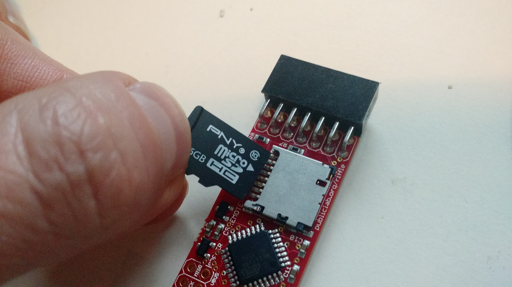
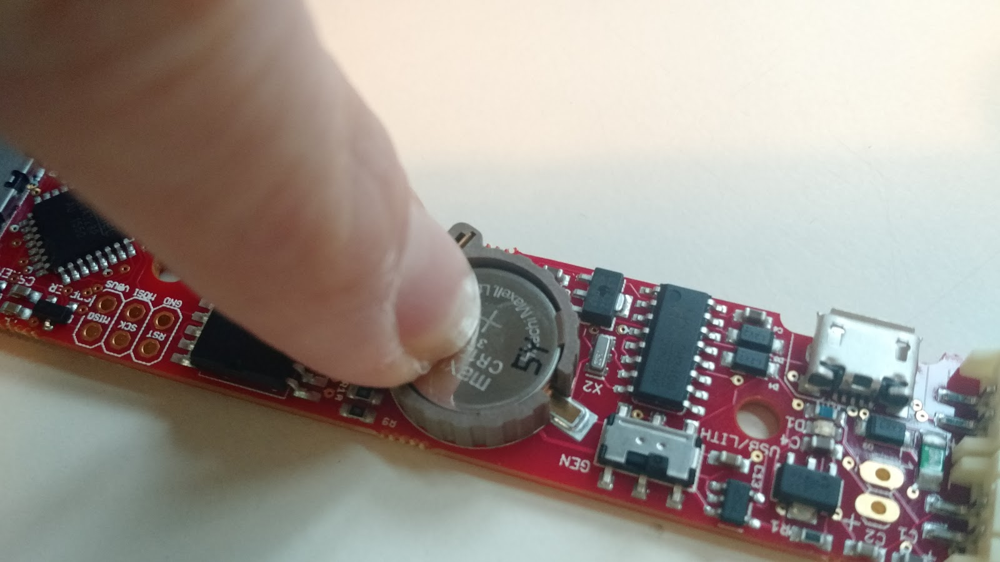

#Welcome!

This is a set of code and instructions for getting started with the [Riffle](test) datalogger.  Using the code in this repository, you should be able to blink the onboard LED, set the onboard Real Time Clock (RTC), and log sensor readings to the onboard microSD card.   

- If you already have experience using Arduino-compatible boards, check out the [Quick Start](https://github.com/dwblair/Riffle-Getting-Started#quick-start) section below to get up and running quickly. In general, the Riffle behaves like an Arduino UNO in the Arduino IDE (you should select "Arduino UNO" as the "Board" in the IDE), but you'll need to install a **special driver** (see [Software prep](test), below) in order to program the device over USB if you're using Mac or Windows.  

- If you would prefer more detailed instructions for setting up your Riffle, please check out the [Step-by-Step Instructions](test).

# Quick Start

## Hardware prep

- You'll need a Riffle board, 3.7 V Lithium Ion battery, and CR1220 coin cell battery.

- Insert a microSD card and a CR1220 coin cell into the appropriate slots on the Riffle.

- Insert a lithium ion battery into the 'Lith/USB' JST connector (JST connector labels are on the back side of the board).

- Make sure that the switch on the Riffle is switched to the side labeled 'Lith/USB' (label is next to switch).

## Software prep

- Make sure that the Arduino IDE (version 1.6.10 or higher) is installed.  If it
 isn't, get it [here](https://www.arduino.cc/en/Main/Software).

- **Installing the USB-Serial Driver**. On Mac or Windows, the Riffle requires a special driver in order to be programmed via the Arduino IDE, due to the onbaord CH340 USB-Serial chip.  For Windows, you can use the driver [here]( http://raysfiles.com/drivers/ch341ser.exe).  For Mac, follow instructions [here]( http://www.instructables.com/id/Arduino-Nano-CH340/). Linux systems should generally not require additional drivers.

- Copy all of the folders in 'arduino_libraries' into the 'libraries' folder inside the 'sketchbook' folder associated with the Arduino IDE install.  These libraries are necessary for running the 'temp_logger.ino' and 'set_rtc.ino' sketches in this repo.  

## Blinking the onboard LED 

- Compile and load the 'blink.ino' sketch onto the Riffle, selecting 'Arduino UNO' as the 'Board' version in the Arduino IDE.
- This code is very similar to the standard Arduino IDE 'blink' test, except that for the Riffle, the pin connected to the onboard LED is pin 9, rather than the typical pin 13 on the UNO. This is reflected in the blink.ino sketch.

## Logging values to the microSD card

- Using the Arduino IDE, compile the 'temp_logger.ino' code above, and load it onto the Riffle board, using 'Arduino UNO' as the 'Board' version in the Arduino IDE.

- The Riffle should start logging temperature values to the microSD card. These temperature values come from the on-board RTC, and so may be affected by the temeprature of the board (which might slightly higher than ambient temperature, due to the operation of its circuitry). 

- Note: the RTC will have its time set automatically to the system clock when it is programmed via the Arduino IDE.

## Extending the battery lifetime

- Set DEBUG = 0 in temp_logger.ino. This will reduce power by turning off the Serial interface.  It will also mean that the RTC is not set by the System clock.

- Use the 'GEN' JST connector on the Riffle board.  This power input doesn't have a protective diode, thus avoiding a diode-associated voltage drop, and can power the Riffle down to lower battery voltages.

- Test out different microSD cards;  some of them 'sleep' at lower power settings than others.
